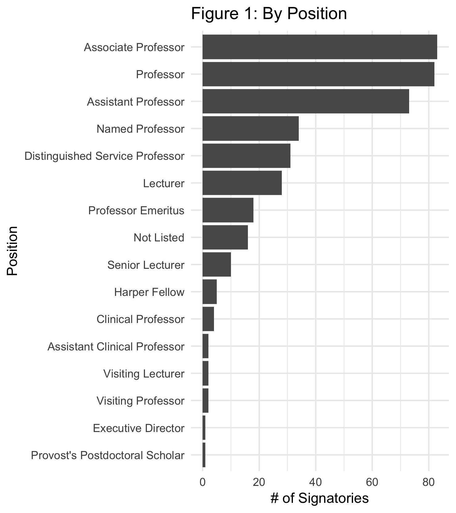
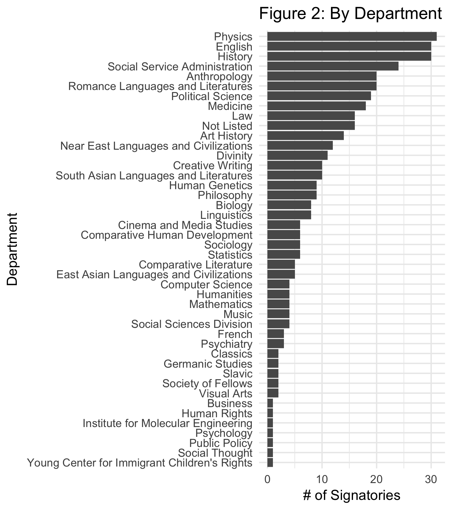
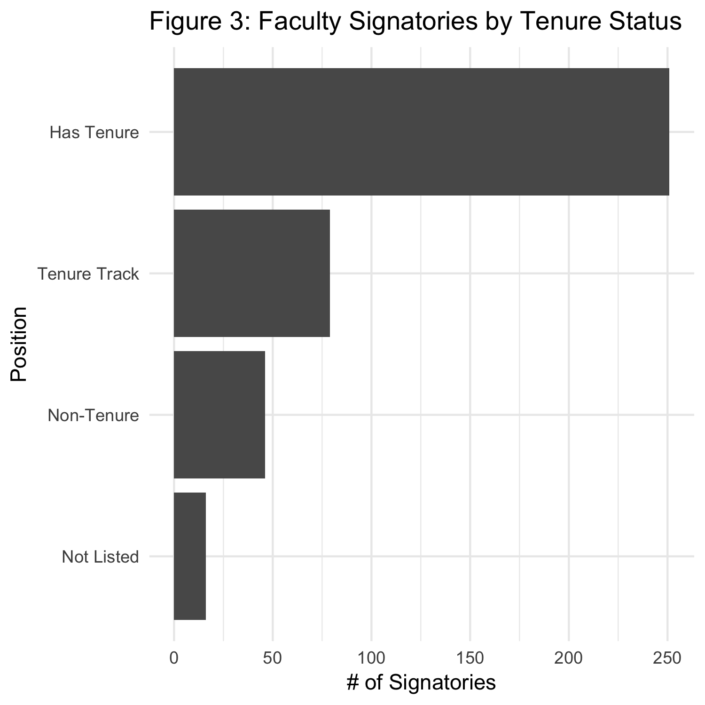
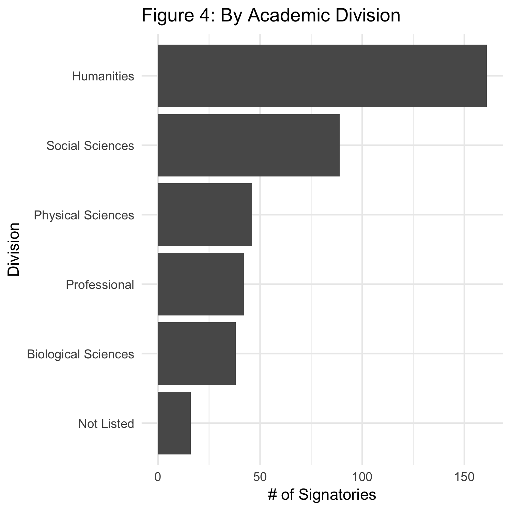
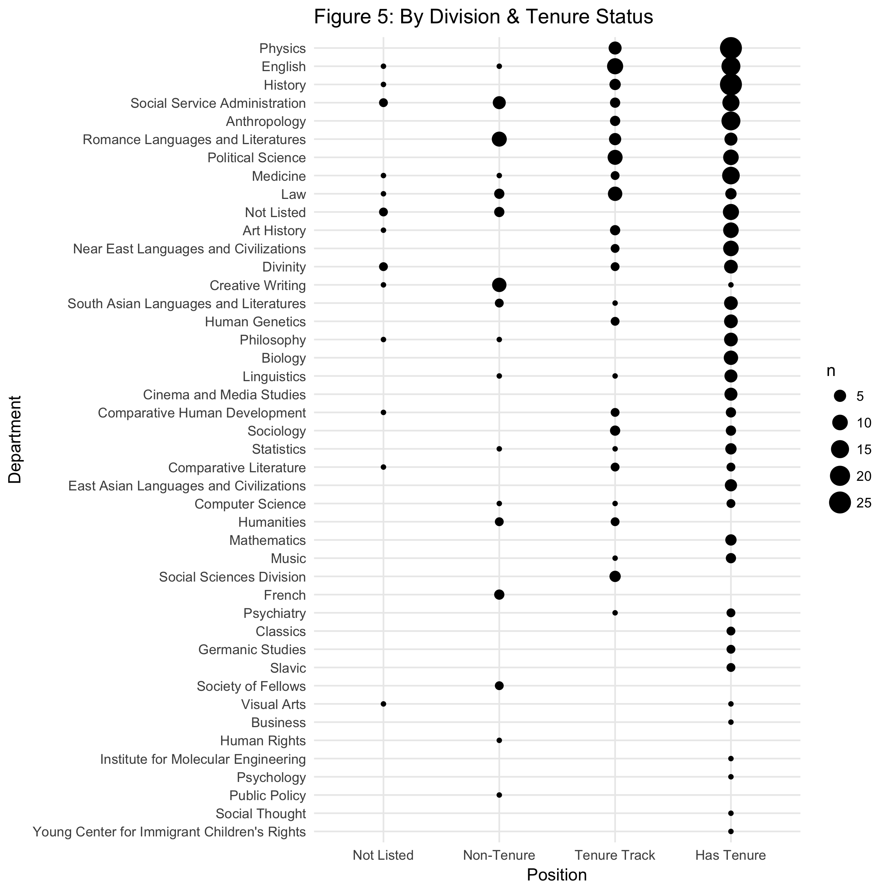
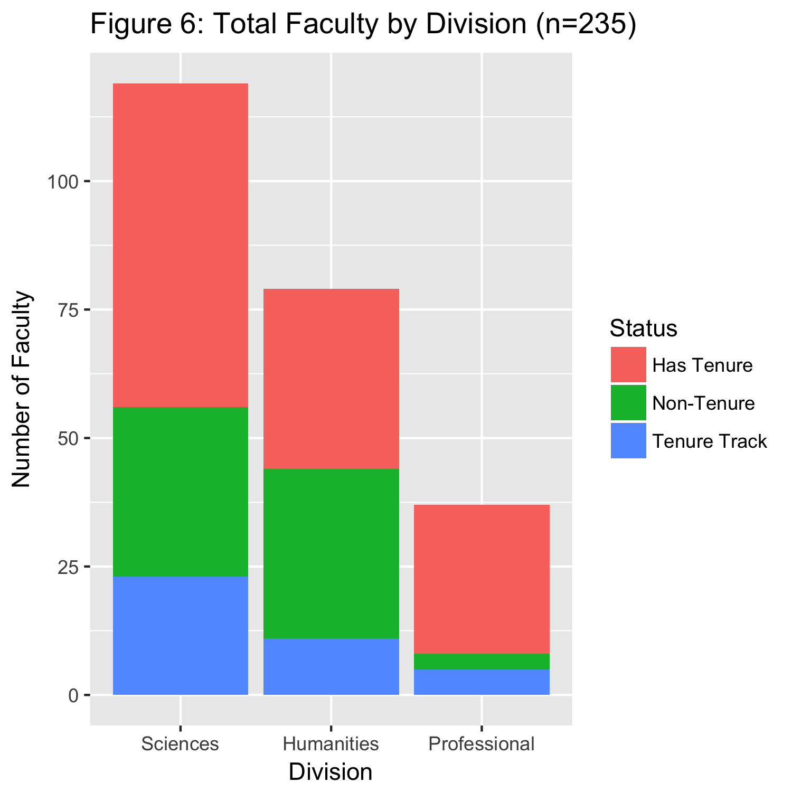
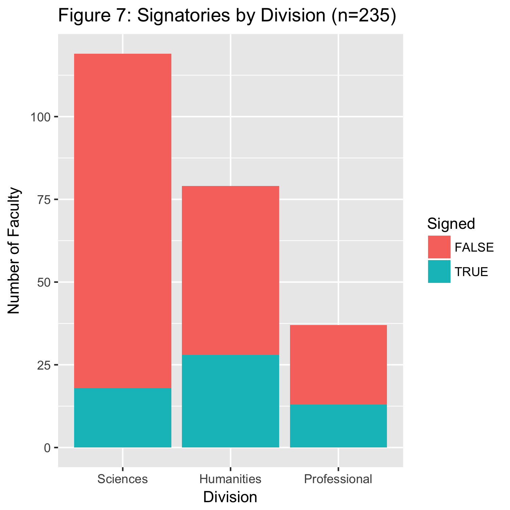

  
###Introduction
On December 1, 2016, 390+ faculty members at the University of Chicago sent a [letter](https://docs.google.com/forms/d/e/1FAIpQLSdozFBhNzeHZPQAywaxG9YHOx9BYBxL3dxPyDXFPV6fXIbuqg/viewform?c=0&w=1) to Provost Diermeier and President Zimmer concerning the university's response to potential changes to U.S. immigration policy following Donald Trump's presidential election victory. It opens as follows: 

> We, the undersigned faculty, write you to offer concrete proposals toward fulfilling your and the University’s stated commitment to our undocumented students. We are alarmed by President-elect Donald Trump’s declared intention to implement policies that threaten the civil rights and well-being of members of our community. We believe that the University has a clear responsibility in these urgent circumstances. As one of the country’s premier research universities with a large and diverse student body, and with a history of offering support and refuge to members of persecuted minority groups, we hope that the University of Chicago can take a leading role in opposing the measures promised by President-elect Donald Trump and actively defend this institution’s core interests and values.  

The letter proposes 9 concrete steps the administration should take to ensure financial, legal and mental health support for students that might be affected. The aim of this project is understand some of the factors that might influence the decision by faculty to engage in campus activism. Motivated by the successes of SNCC and other student organizations during the civil rights movement, social change scholars over the past four decades have deeply studied the impact of student activism on the broader culture. Surprisingly, faculty activism over the same period has been greatly under-examined. This isn't because it's unimportant, but unfortunately, most examinations of faculty activism have tended to focus on ideology, not mobilization (for context, see scholarship around the [science wars](https://en.wikipedia.org/wiki/Science_wars)). 

Using this recent letter as a point of departure, I'm interested in better understanding what factors are involved in faculty decisions to participate in an openly political act. This is not without risk. While tenure evaluations are supposed to be objectively focused on scholarly output, examples of politically-involved academics being denied tenure or losing their positions abound. Anthropologist David Graeber's [case](http://www.nytimes.com/2005/12/28/nyregion/when-scholarship-and-politics-collided-at-yale.html) at Yale is one of the most prominent in recent years.  

In this admittedly provisional analysis, I will examine the tenure status and department affiliation of all faculty signatories to the letter. My hypothesis is that faculty members that have already secured tenure will be overrepresented in comparison to faculty who are on the tenure track but have not yet received it, as well as lecturers and adjunct professors whose positions are not guaranteed. For two reasons, I also anticipate that department affiliation will skew towards the social sciences and humanities. First, immigration is an issue that's treated academically in many of these departments, as opposed to say molecular chemistry. Second, these are considered to be the more liberal divisions within the university. In a 2005 study by [Lichter et al](http://www.cwu.edu/~manwellerm/academic%20bias.pdf) examining the ideological composition of American university faculty members, 81% of humanities scholars and 75% of social scientists considered themselves to hold liberal values. These figures were markedly lower for engineering and business faculty, 51% and 49% respectively. 

***

### Faculty Signatories  
The data includes the name, department affiliation and position for 392 faculty members who had signed the letter by December 3, 2016. To search for the names of signatories from a particular department, follow this [link](https://rishigarora.shinyapps.io/hw10/).  The distribution of positions can be seen in Figure 1. The five largest groups are all either tenured or in tenure track positions. Lecturers represent the highest proportion of non-tenured faculty signatories.

***

  

***
  
Figure 2 shows the distribution of signatories by department/division. Many faculty members hold multiple appointments in different departments, so they were coded using the first affiliation they listed in their signature line. The fact that  English, History and Social Science Administration are the most represented departments has face validity and supports my initial hypothesis, but Physics leading the pack is quite surprising. My prediction, and this is something that could be tested further by interviewing members of all of the departments, is that some departments circulated the letter on their internal listserv while others didn't. How large an effect this has on overall participation would be a worthwhile inquiry. 

***

  

***

It's good to have a sense of the overall data, but to conduct the analysis I regrouped the data based on tenure status (Non-Tenure, Tenure Track, Has Tenure) and academic division (Humanities, Social Sciences, Physical Sciences, Biological Sciences, and professional degree programs like Law). Figures 3 and 4 show these updated plots and Table 1 provides a summary of tenure status. 

***

__Table 1: Tenure Status of Faculty Signatories__ 

Has Tenure | Tenure Track | Non-Tenure | Not Listed
------------- | ------------- | ------------- | -------------
251 | 79 | 46 | 16

***

***

 

***

  

***

Figure 5 brings together department affiliation data with tenure status and provides the launching point for our model. The width of the circles represent the number of faculty signatories from each department and the x-axis is ordered by job security. This plot seems to show that the more secure faculty is in their position, the more likely they are to participate in activism. We can see that the largest circles are concentrated on the right side of the chart and that the trend seems to hold for the range of departments represented. The statistical signficance of this finding will be interrogated below. 

***

  

***

### Model
Up until this point, we've only been analyzing faculty members who actually signed the letter. This critically leaves out half of the data we would need to construct a model for factors influencing the propensity to sign, namely data on all of the faculty members that _didn't_ sign. Since it would be quite tedious to compile data on every faculty member at the university, I instead collected data from six representative departments in the Humanities, Sciences, and Professional Schools. These six are Romance Languages and Literature, Philosophy, Statistics, Human Genetics, Computer Science and the School of Social Service Administration. In total, there are 235 faculty members in the dataset. If I choose to continue researching this question it would be best to compile a more comprehensive dataset, or at the very least, develop a more robust sampling method. Figures 6 and 7 provide an overview of the sample. 

***

  

***

 

***

We're dealing with a binary dependent variable (signed or not) so I used a binomial model to regress division affiliation and tenure status on the outcome. I did this twice, once with interaction terms, once without. The interaction terms did not end up being significant in for this dataset. The output results from the first model, without interaction terms, are printed below: 

***

__Logistic Regression Model Output:__ 

~ | `Estimate` | `Std. Error` | `Z value` | Pr(>`|Z|`) |
------------- | ------------- | ------------- | -------------| ------------- |
`(Intercept)` | -2.1017 | 0.3896 | -5.394 | 6.87e-08*** |
`d Tenure Track` | 0.7498 | 0.4824 | 1.554 | 0.120103 |
`d Has Tenure` | 0.3951 | 0.3872 | 1.021 | 0.307460 |
`d Professional` | 1.0732 | 0.4377 | 2.452 | 0.014203* |
`d Humanities` | 1.2129 | 0.3559 | 3.408 | 0.000655*** |

Significance Level: 0`***` ; 0.05`*`

***

We can see that division affiliation and the intercept are highly significant, which confirms the initial hypothesis that the decision to sign is essentially non-random. The likelihood a faculty member signs is definitely higher in some divisions than others. But we expected tenure status to be significant as well. From examining the plots above, this still appears to be true, but it's possible that we still don't have enough data for this to become clear with this particular statistical test. The first thing to do to move the project forward would be to dive into this variable more deeply. 

***

### Conclusion

***

I've demonstrated above that division affiliation had a highly statistically significant impact on a faculty member's propensity to engage in activism in this case. While the visual representations imply a similar relationship with tenure status, this did not end up being the case in our model. There are many possible avenues for future research (besides solving the tenure question!). First, it would be useful to understand how this propensity varies in relation to social factors like race and gender. Second, we need to get a better handle on how the letter was shared both inter- and intra-departmentally. As I previously mentioned, some departments have a significantly higher proportion of signatories than others, and some of these are departments we wouldn't have initially predicted. Was this because the letter was promoted and circulated by someone within that department? How does a petition like this one get circulated _between_ departments? My hunch would be that there are existing social networks of listserv managers and department administrator's who take on the burden of distributing this type of material, but this would need to be analyzed much more closely. Thirdly, how does participation vary based on the cause being promoted? The past election was a huge hot-button issue on campuses all over the country, but what about more mundane issues like budgeting and resource allocation? Lastly, how does faculty activism at UChicago stack up against other universities of varying status or prestige? Does Chicago's elevated status offer some breathing room for faculty members to engage on campus more freely or is it actually a burden, as they perceive themselves to have more to lose?